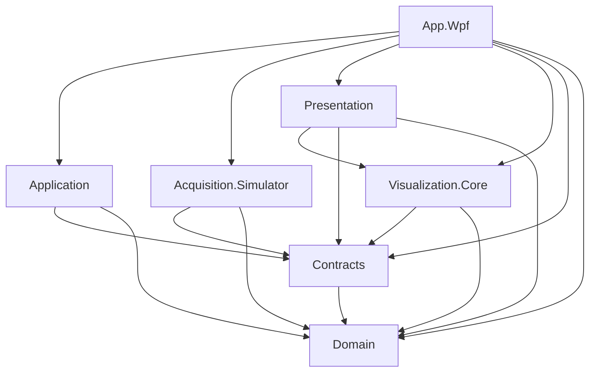

# Arquitectura inicial

Estado: estructura aprobada el 2026-09-09, scaffolding existente desde 2026-09-10 y diseño corregido/aprobado el 2026-09-11; implementación funcional pendiente. Trazabilidad: R01–R03, R08–R13; ADR 0001–0004, [ADR 0005](../adr/0005-initial-solution-structure.md) y [ADR 0006](../adr/0006-session-window-lifecycle.md).

## Estructura inicial aprobada

La primera sección vertical será simulador -> sesión -> A-Scan neutral -> ViewModel -> ventana WPF. Existen siete proyectos productivos bajo `src/` y un proyecto de pruebas bajo `tests/`; no recrear el scaffolding. Esta aprobación no autoriza generar código o paquetes en la fase documental.

| Proyecto UTStudio.* | Responsabilidad inicial | Referencias directas permitidas |
| --- | --- | --- |
| Domain | Identidades, unidades, configuración y reglas UT; canal físico, elemento, beam y ley focal distintos | Ningún proyecto propio |
| Contracts | Puertos y datos neutrales necesarios para fuente, sesión y comunicación | Domain |
| Application | Casos de uso, sesión activa y coordinación de inicio, parada, cancelación y fallo | Domain, Contracts |
| Acquisition.Simulator | Fuente sintética determinista, tiempo controlable y fallos reproducibles | Domain, Contracts |
| Visualization.Core | Modelo y transformación A-Scan neutrales, sin controles ni renderizador concreto | Domain, Contracts |
| Presentation | ViewModels, estado observable, coordinación de la transformación visual y servicios UI abstractos | Domain, Contracts, Visualization.Core |
| App.Wpf | Ejecutable, vistas, adaptación WPF y raíz de composición | Los seis proyectos neutrales |
| Core.Tests | Pruebas neutrales agrupadas por responsabilidad y comprobaciones de arquitectura | Los seis proyectos neutrales; nunca App.Wpf |

Los proyectos neutrales y Core.Tests tendrán objetivo `net10.0`; App.Wpf, `net10.0-windows`. MSTest 4.0.2 está aprobado/presente desde 2026-09-10; mocking, CI y paquetes adicionales siguen pendientes (Q10).

La flecha A -> B significa que A puede referenciar B; no representa el flujo de datos. Ninguna dependencia inversa se permite por comodidad.

Core.Tests se omite del diagrama productivo. Application publica datos/snapshots mediante Contracts y no conoce Visualization.Core. Presentation coordina la transformación neutral antes de entregar el modelo al ViewModel; esto no obliga al ViewModel ni al hilo UI a procesar cada frame.

## Contratos y límites

Contracts se organiza conceptualmente en `Acquisition`, `Application`, `Presentation` y `Diagnostics`: fuente y capacidades; casos de uso y sesión; intercambios neutrales compartidos de presentación; estado y contadores diagnósticos, respectivamente. No crear contratos futuros innecesarios ni un proyecto por carpeta. Los modelos A-Scan pertenecen a Visualization.Core; no se duplican en Contracts ni hacen que Contracts lo referencie.

Los puertos exclusivamente UI (navegación, diálogos, selector de archivos, portapapeles y planificación UI) permanecen en Presentation. Contracts/Presentation no es un contenedor de tipos de plataforma.

Dependencias prohibidas: Domain hacia cualquier otro proyecto; Contracts hacia implementaciones; Application hacia adaptadores concretos o presentación; Presentation hacia Application o adquisición concreta; adaptadores de adquisición/almacenamiento hacia Application o UI; cualquier proyecto productivo hacia App.Wpf o tests. Se prohíben ciclos y referencias WPF/Avalonia directas o transitivas en el núcleo y ViewModels. Las referencias a implementaciones desde App.Wpf son para composición, no para acceso directo al hardware desde vistas.

## Comunicación y ciclo de vida
Los casos de uso operan mediante interfaces inyectadas. Los ViewModels no acceden al hardware ni se referencian entre sí; reciben servicios y snapshots de stores mediante IObservable<T> o equivalente. Messenger sirve solo para notificaciones ocasionales de presentación. Frames circulan por ChannelReader<T> de canales acotados.
La sesión pertenece a Application. Cerrar MainWindow solicita salir: cancelar productor mientras el único lector drena, esperar buffers devueltos, desconectar y detener/liberar Host antes del cierre definitivo. MainWindow permanece abierta durante limpieza y diagnóstico tras cinco segundos. Sin bandeja, OnExplicitShutdown ni ejecución sin ventanas. Una futura secundaria podrá cerrarse sin detener sesión. Véase [ADR 0006 revisado](../adr/0006-session-window-lifecycle.md).

El [ADR 0007](../adr/0007-frame-source-ownership.md) concreta frame RF `ReadOnlyMemory<short>` y ownership exclusivo; el [ADR 0008](../adr/0008-latest-only-visual-delivery.md) concreta snapshots versionados, notificaciones fuera de locks, mailbox latest-only, máximo 1.024 puntos/30 Hz y métricas a 5 Hz. Las operaciones largas admiten CancellationToken. No compartir un ChannelReader entre consumidores competidores: la futura distribución tendrá ramas separadas para procesamiento y almacenamiento sin pérdida silenciosa, visualización latest-only y métricas mediante muestreo. El ownership compartido se decidirá antes de introducir varios consumidores; el ownership inicial queda definido en ADR 0007. Véase [pipeline](data-pipeline.md).

## Frontera WPF/Avalonia
Presentation no importa WPF ni Avalonia. Los servicios UI abstractos se implementan inicialmente dentro de App.Wpf, separados por carpetas de composición, vistas y servicios. La extracción de Presentation.Wpf o Visualization.Wpf se aplaza hasta que una responsabilidad real la justifique. Estas abstracciones no se inyectan en hardware.
App.Wpf configura Hosting, DI por constructor, configuración y logging, construye las ventanas y coordina arranque/cierre. No es propietario de la lógica de sesión. Los servicios de plataforma no visuales se abstraen en la frontera neutral que los necesita; no se crea un proyecto Platform genérico.
Solo proyectos .Wpf referencian WPF. Tipos UI como Brush, Color, Point, BitmapSource, WriteableBitmap, Dispatcher y Window no aparecen en APIs públicas del núcleo. Usar unidades, coordenadas y formatos de píxel neutrales explícitos.
MainWindow compone explícitamente ViewModels independientes y suscripciones. Su cierre solicita salida; no crear scopes genéricos por ventana. La primera secundaria exigirá definir propiedad local y presupuesto; cerrarla no detendrá sesión. La frecuencia visual es limitada; nunca un control XAML por muestra.
La futura UI Avalonia sustituirá adaptadores y composición. La portabilidad del núcleo no garantiza soporte Linux del SDK PCIe. Aislar también SDK de futuros PLC, robot y encoders.

## Proyectos aplazados y fuentes futuras

No crear todavía SignalProcessing, Storage, Acquisition.GigE, Acquisition.Pcie, Reporting/Reporting.Pdf, PLC, Robot, Avalonia ni 3D. También se aplazan Acquisition.Core, importadores, adaptadores WPF separados y proyectos por modalidad de scan. Acquisition.Core solo se justificará con implementación compartida real. PDF sigue previsto dentro de v1 conforme al ADR 0004.

GigE, PCIe, simulador y reproducción compartirán un contrato de fuente con capacidades explícitas, sin fingir controles hardware en archivos. GigE encapsulará su protocolo; PCIe, su SDK y memoria. La reproducción comenzará como adaptador de Storage con lectura parcial y ritmo controlable, sin requerir decodificación de paquetes. Importar formatos es una responsabilidad distinta.

SignalProcessing, Storage y Visualization.Core mantendrán dependencias neutrales hacia Domain/Contracts; los adaptadores reales también. Reporting conservará el modelo neutral y Reporting.Pdf será su renderizador separado. Avalonia tendrá composición propia; 3D, PLC y robot se incorporarán mediante límites neutrales y adaptadores cuando exista un caso de uso. PLC y robot no son automáticamente fuentes de muestras UT.

## Decisiones abiertas y siguiente incremento

Q12: propiedad de sesión, cierre principal y snapshots iniciales resueltos por ADR 0006/0008; concurrencia de inspecciones y recursos de secundarias pendientes. Q13: flujo inicial y ownership exclusivo resueltos por ADR 0007/0008; fan-out, ownership compartido y relación con persistencia pendientes. Q06 conserva datos crudos/procesados y durabilidad.

Pendientes mocking/CI y paquetes adicionales (Q10), renderizado y benchmarks (Q09), y futuras integraciones. ChannelCapacity=4 y BufferCount=8 son internos configurables del simulador sujetos a benchmarks, no del contrato general. Véanse el [plan del primer incremento](../plans/2026-09-09-first-vertical-increment.md), [almacenamiento](storage.md) y [pruebas](testing.md).
